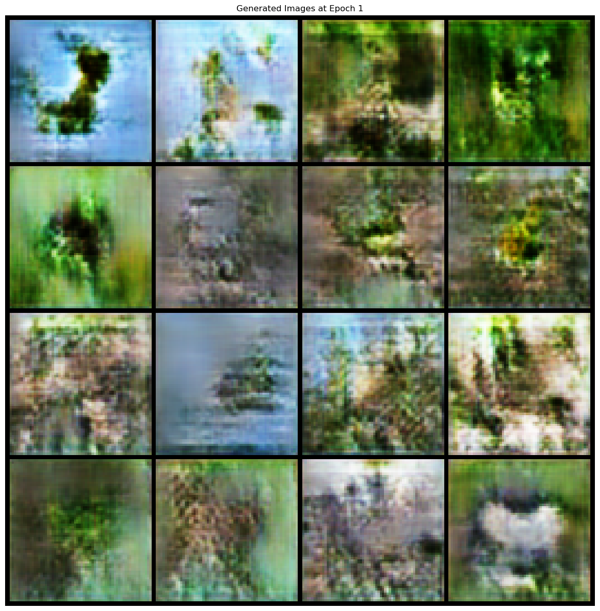
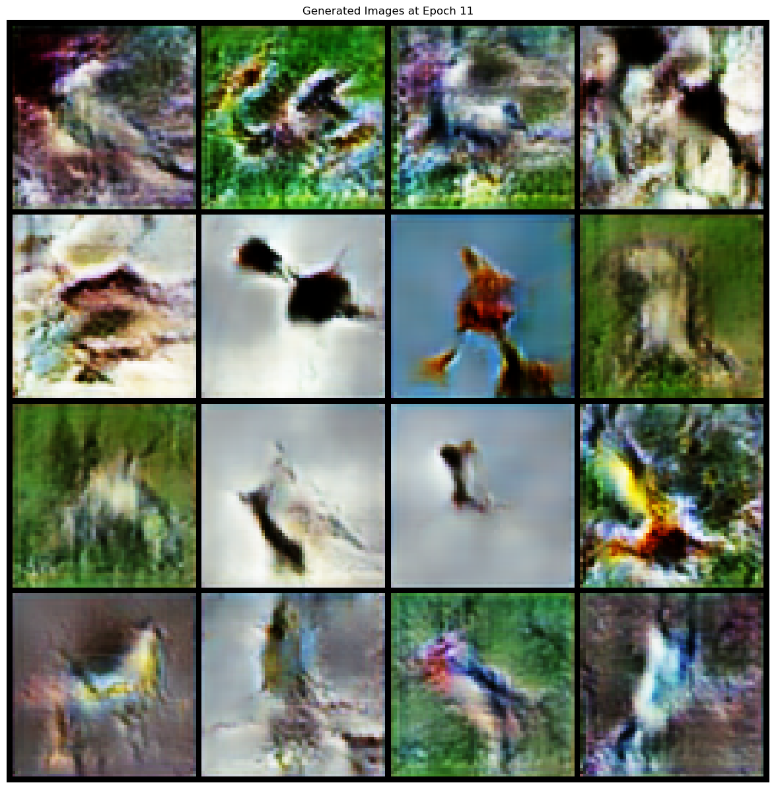
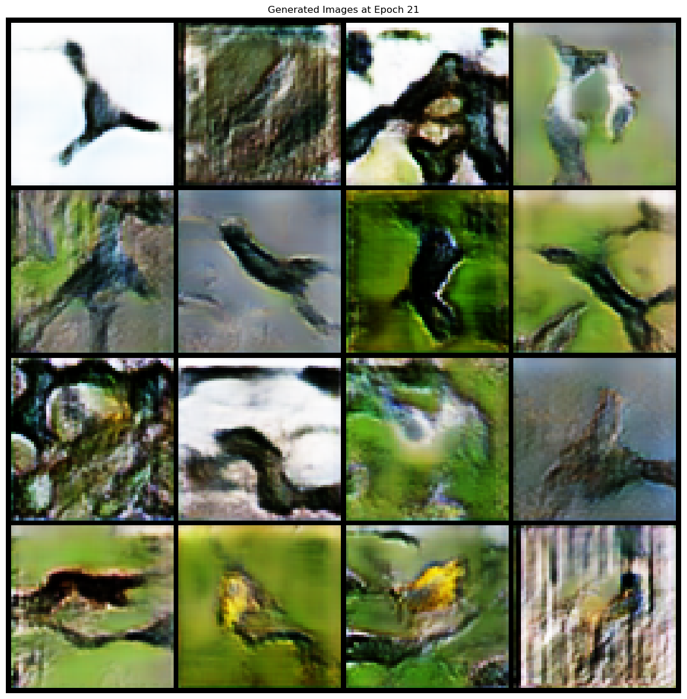

# Text-to-Image Generation using GANs 🐦🧠🎨

This project demonstrates **Text-to-Image Generation** using **Generative Adversarial Networks (GANs)** trained on the **CUB-200-2011 Birds Dataset**. Developed as part of the Alternate Assessment Tool (AAT) for the subject **Machine Learning (22EC554)** under the Department of Electronics & Communication Engineering, DSCE (2024-25).

## ✨ Abstract

Using models like **StackGAN** and **AttnGAN**, this system converts textual bird descriptions into realistic synthetic images. The system helps overcome the challenge of limited labeled data, with practical applications in **data augmentation**, **ecological modeling**, and **AI training**.

## 🧠 Algorithms & Concepts

- Generative Adversarial Networks (GANs)
- Text Embedding using Word2Vec/BERT
- KL Divergence Loss
- Deep Convolutional Neural Networks (DCNN)
- Attention Mechanisms
- Perceptual Loss

## 📊 Results

- Epoch 1: Discriminator Loss = 1.32, Generator Loss = 1.65
- Epoch 10: Discriminator Loss = 1.00, Generator Loss = 1.14
- Epoch 20: Discriminator Loss = 0.88, Generator Loss = 1.29

Below are example images generated by the model over multiple training epochs:

### 🐣 Epoch 1

### 🐦 Epoch 10

### 🎯 Final Output (Epoch 20+)

- **Epoch 1** – Basic bird-like shapes and color blobs appear
- **Epoch 10** – Form and color start aligning with textual embeddings
- **Final** – Generated images resemble the described birds more accurately

  
## 🚀 Future Enhancements

- Real-time prompt input
- High-resolution image generation
- Faster inference
- Interactive image customization

## 📜 License

MIT License
